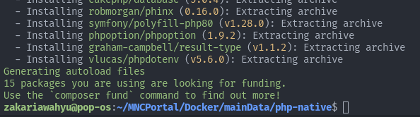
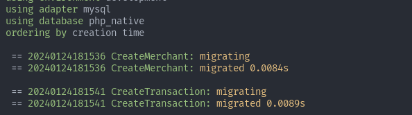
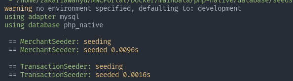

# PHP-NATIVE ✨

### Libraries
* [robmorgan/phinx](https://github.com/cakephp/phinx) - PHP Migrate and Seeder Database
* [vlucas/phpdotenv](https://github.com/vlucas/phpdotenv) - PHP environment variables

### Required 1 database connection
```
# run MySQL in Docker
docker run -d -p 3306:3306 mysql -e MYSQL_ROOT_PASSWORD=masukdb -e MYSQL_DATABASE=php_native
```
## Running Application
1. Run Composer install


2. Copy .env.example to .env and fill the blank config
```azure
DB_HOST=
DB_PORT=
DB_USERNAME=
DB_PASSWORD=
DB_NAME=php_native
```
3. Create new database php_native
4. Run migration and seeder database
```
$ make migrate && make seeder
```
or
```
$ vendor/bin/phinx migrate -e development && vendor/bin/phinx seed:run
```



5. Run localy with xampp or docker

## API Documentation
### Get Transaction
```http request
GET /transaction/{reference_id}/{merchant_id}
```
```javascript
Response
{
    "success": "true",
    "code": 200,
    "data": {
        "id": 2,
        "status": "Pending"
    }
}
```
### Create Transaction
```http request
POST /transaction
```

```javascript
Body Request
{
    "invoice_id" : "INV-123",
    "item_name" : "T-Shirt",
    "amount" : 5000,
    "payment_type" : "virtual_account",
    "customer_name" : "Zakaria",
    "merchant_id" : 6
}

Response
{
    "success": "true",
    "code": 200,
    "data": {
        "id": "2",
        "no_va": 244593345,
        "status": "Pending"
    }
}
```
### Update Transaction
```
$ php update-cli.php :reference_id :status
```